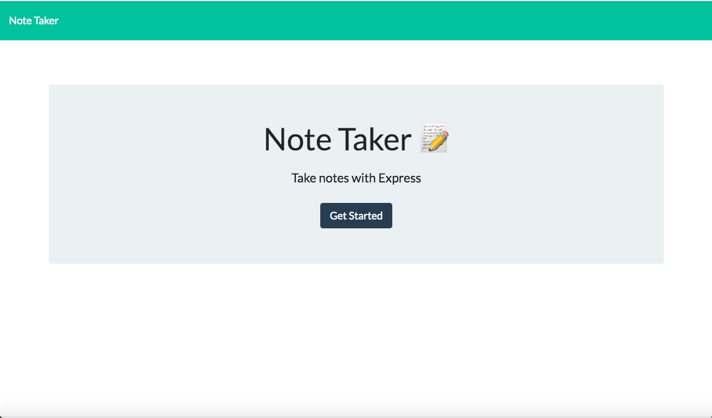
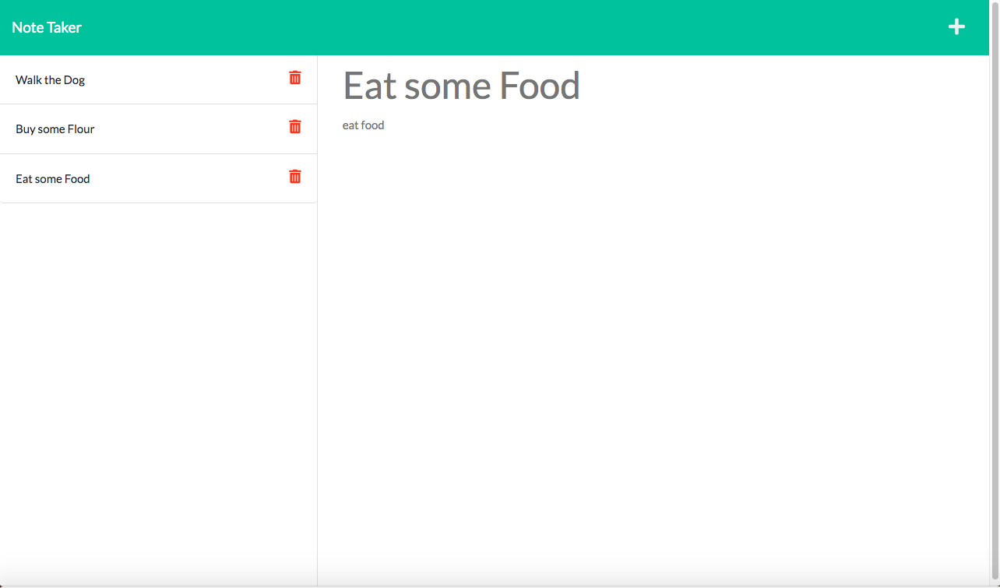

# Express-Note-Taker 

## Description 
This project was inspired by the need from small business owners to be able to write and save notes that they can eventually delete after they are not needed. They can use these notes to keep track of things they need to do so that they are organized and stay on top of things. I made this application to be accessed on live servers, hosted by Heroku, so that any business owner can pull up the website when they need to use it. All of the notes are stored in a database/JSON file and can be stored and deleted from the website. 

## Table of Contents 
* [Installation](#installation)
* [Usage](#usage)
* [Credits](#credits)
* [License](#license)
* [Contribute](#contribute)
* [Testing](#testing)
* [Questions](#questions) 

## Installation
No installation is required, You can access the full functionality of the app through the live website.

## Usage
App can be used by typing in the title of your note and the text which will pop up a save icon so that you can save the note in the side bar on the left. If you want to view old notes you can simply click on them to pop them back on the right-hand display. If you want to add a new note you can click the plus at the top right of the screen. If you want to delete any old notes you can hit the trash icon next to the note. 

## Credits
Creator: Keyshawn Bhagwandin

Apps used: 
* Heroku to deploy website: https://dashboard.heroku.com/apps
* Express.js
* Node.js

## Demo
Here a look at the application interface:

## Deployed Application

Here is the Link for the deployed application!: 

## License
MIT License, Here is the link for more details: https://opensource.org/licenses/MIT [] 

## Contribute 
N/A

## Testing 
N/A

## Questions 
Please free to email me at keyshawn.11@hotmail.com for any questions
check out my Github: https://github.com/keysbhag 